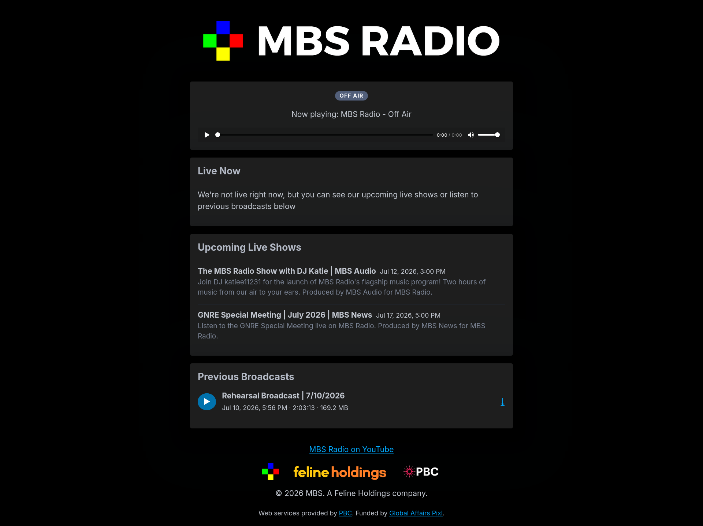
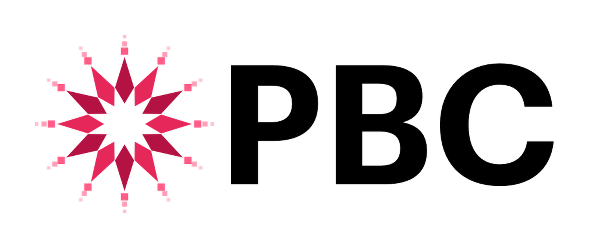

# Broadcast Infrastructure for MBS Radio
**Developed by PBC and funded by Global Affairs Pixl**
---


This repository contains the infrastructure and custom software powering the MBS Radio internet radio stream. There are three main components:
- Icecast2 (Audio Distribution) `icecast/`
- LiquidSoap (Source ingest, recording, and automation) `liquidsoap/`
- Custom Node webapp (Player + Recording Viewer/Manager) `webapp/`

## Running
After creating a `.env` file based on `.env.example` file, you can run the entire stack with Docker Compose:

```bash
docker compose up --build
```

You will need to provide your own reverse proxy for Icecast and the player/management web app, see `nginx.conf.example`. The Liquidsoap harbor ingest endpoints should be exposed directly, as running them through a reverse proxy will cause issues with the source connection.

**Endpoints**
- `localhost:9000/primary` — Primary source ingest (Liquidsoap)
- `localhost:9000/guest` — Guest source ingest (Liquidsoap)
- `localhost:8001/stream.mp3` — Public stream (Icecast, mp3)
- `localhost:8001/stream.ogg` — Public stream (Icecast, Opus)
- `localhost:8010/` — Public Web Player UI
- `localhost:8010/manage` — Management Console UI (password in `.env`)

### Streaming
Any Icecast 2 client can connect to the /primary and /guest endpoints, using the password defined in `HARBOR_PASSWORD`.

> Note that your client must use Icy metadata for MP3 streams, OR inline metadata for Ogg Vorbis/Opus streams. Icy metadata cannot be used with Ogg streams (though many clients will try).

Both the primary and guest endpoints audio are mixed together, allowing for seamless handoff for live shows. When no source is connected to either, Liquidsoap will loop through the off-air tracks in the `music/` directory.

## License and Disclaimer
The software in this repository is licensed under the GNU Affero General Public License v3.0 (AGPL-3.0). See the [LICENSE](LICENSE) file for details.

> MBS and PBC are roleplay companies on the [Minecart Rapid Transit](https://wiki.minecartrapidtransit.net/index.php/Main_Page) Minecraft server.

